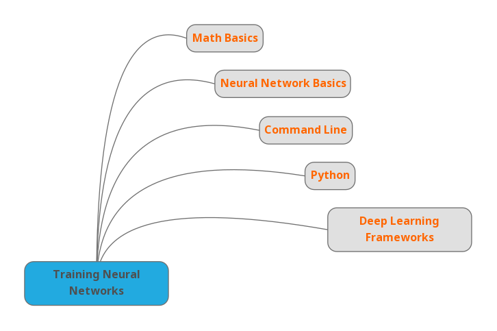

# Getting started with NNs

This guide is for anyone who wants to start working with neural networks but has little to no prior experience and does not know where to start. It can useful if you are a math student, a life scientist or anyone else interested in data analysis. 
We will cover basic concepts, as well as programming tools, that you need to get started with neural networks. The guide is organized into sections as in the map above and you can read it in the order that is most convenient for you, as well as skip some sections altogether if you are familiar with concepts covered in them.

# Table of Contents
1. [Math Background](#math_background) 
2. [Neural Network Basics](#nns_basics)
3. [Command Line Basics](#cl_basics)
5. [Hardware and OS](#hard_os)
4. [Python](#python)
5. [Deep Learning Frameworks](#dl_frameworks)
6. [Training Neural Nets](#train_nns)
7. [Research Experiments with neural nets](#resexp_nns)
8. [Data Analysis](#data_an)

## Math Background 

Areas of math that are most commonly used in neural networks are (more or less in the order of importance):

* **Linear Algebra** (vectors, matrices and various operatins with them)
* **Calculus** (gradients and integrals)
* **Probability and Statistics** (random variables, expectations, variance, Bayes' theorem)
* **Optimization Algorithms** (minimization or maximization)
 
If you are familiar with basics of these fields, especially with matrices and gradients (e.g. you took Linear Algebra and Multivariable Calculus courses), you can skip this section. Otherwise we recommend that you obtain basic understanding of matrices and gradients. 

You can start with videos by [3blue1brown](https://www.3blue1brown.com), who created a series on the basics of linear algebra, calculus and multivariable calculus. You can either watch the entire series or just stop watching after feeling comfortable with matrices and gradietns. 

* [Linear Algebra Series](https://www.youtube.com/playlist?list=PLZHQObOWTQDPD3MizzM2xVFitgF8hE_ab)
* [Calculus Series](https://www.youtube.com/playlist?list=PLZHQObOWTQDMsr9K-rj53DwVRMYO3t5Yr)
* [Multivariable Calculus Series](https://www.youtube.com/watch?v=TrcCbdWwCBc&list=PLSQl0a2vh4HC5feHa6Rc5c0wbRTx56nF7)

You can also have a look at the following free online courses from [Khan academy](https://www.khanacademy.org):

* [Linear Algebra](https://www.khanacademy.org/math/linear-algebra)
* [Multivariable Calculus](https://www.khanacademy.org/math/multivariable-calculus)
* [Statistics and Probability](https://www.khanacademy.org/math/statistics-probability)

If you prefer written or more in-depth sources, you can have a look at the following:

* [_Linear Algebra Review and Reference_ by Zico Kolter (updated by Chuong Do)](http://cs229.stanford.edu/section/cs229-linalg.pdf)
* [_Introduction to Linear Algebra_ by Gilbert Strang](http://math.mit.edu/~gs/linearalgebra/)
* [_Review of Probability Theory_ by Arian Maleki and Tom Do](http://cs229.stanford.edu/section/cs229-prob.pdf)

For the next section you should understand why the gradient is pointing in the direction of steepest descent and  matrix multiplication.

## Neural Network Basics 
You can skip this section if you already know what a neural network is, what a loss function and the backpropagation algroithm is. Before traininig neural networks you should know what a neural network is. The following video series by [3blue1brown](https://www.3blue1brown.com) provides an excellent intuitive introduction to the basics of neural networks.

[https://www.youtube.com/playlist?list=PLZHQObOWTQDNU6R1_67000Dx_ZCJB-3pi](https://www.youtube.com/playlist?list=PLZHQObOWTQDNU6R1_67000Dx_ZCJB-3pi)

## Command Line Basics
To run code on your computer or work with remote machines, you often need to use command line. The command languages (or shells) that are available for you depend on your OS. The most commonly used one is Bash, which is the default for most Linux systems and MacOS prior to 2019. You can start learning about it with this tutorial: [https://ubuntu.com/tutorials/command-line-for-beginners#1-overview](https://ubuntu.com/tutorials/command-line-for-beginners#1-overview)

Other common shells for Linux or MacOS (e.g. [Zsh](https://en.wikipedia.org/wiki/Z_shell)) are quite similar to Bash and allow easy transition.

On the other hand, Windows uses Command Prompt (cmd), which is rather different from Bash. You can have a look at this tutorial is you intend to use cmd: [https://www.cs.princeton.edu/courses/archive/spr05/cos126/cmd-prompt.html](https://www.cs.princeton.edu/courses/archive/spr05/cos126/cmd-prompt.html)

## Hardware and OS

## Python
Python is a very popular programming language! It is fair to say that most of deep learning research and applications require Python. The following chart illustrates the rise of popularity of Python.

(Source: https://stackoverflow.blog/2017/09/06/incredible-growth-python/ )

There is an abundance of tutorials for Python. Here is 
[https://www.python-course.eu/python3_course.php](https://www.python-course.eu/python3_course.php)

 

* Libraries
* numpy
* jupyter notebook

## Deep Learning Frameworks 
There is a great number of Python libraries that provide implementations of neural networks, but the most popular ones are Tensorflow and PyTorch:

* [PyTorch](https://pytorch.org/tutorials/beginner/basics/intro.html)
* [Tensorflow](https://www.tensorflow.org/tutorials) (with its user-friendly [Keras](https://keras.io/about/) API)

Both of the libraries allow similar functionality and are well-documented. The choice between them either depends on your project's needs or is just subjective. You can consult some _recent_ blogposts (e.g. [this one](https://medium.com/featurepreneur/tensorflow-vs-pytorch-which-is-better-for-your-application-development-6897d5d4dee0)) to make your choice.

## Training Neural Nets 
There are numerous choices you have to make while building and training a neural network model. They can be categorized as follows:

**Architecture:** First you need to choose the very structure of a network. How many layers should it have? What kind of layers in what order? How many neurons/filters should be in each layer? The number of particular architectures published in DL research is enormous and it's impossible to cover all of them. But to understand more complex architectures, it is important to consider at least these basic classes:
 * Fully-connected networks (Multi-layer perceptrons)
 * Convolutional networks
 * Recurrent networks

**Optimization method:** There is a number of optimization methods beyond gradient descent that are commonly used in deep learning and you need to choose one of them to train your network. You can find a good survey of optimization methods for deep learning in this [blogpost](https://medium.com/analytics-vidhya/different-optimization-algorithm-for-deep-neural-networks-complete-guide-7f3e49eb7d42).  Often adaptive optimization methods or methods with momentum yield better results than simple gradient descent and Adam algorithm is a very popular choice. 

**Hyperparameters:** You need to understand and reasonably choose hyperparameters involved in training, such as learning rate, batch size

**Initialization:**

Commonly used layers are for example:
  * Dense layer
  * Convolution layers
  * Pooling layer
  * Batch Norm layer [https://www.youtube.com/watch?v=nUUqwaxLnWs](https://www.youtube.com/watch?v=nUUqwaxLnWs)
  * Recurrent layers

These layers and many variations of them are implemented in the deep learning frameworks that we covered.

* GPUs and CPUs

## Research Experiments with neural nets
* monitoring different runs with tensorboard
* hyperparameter optimization

## Data Analysis 

